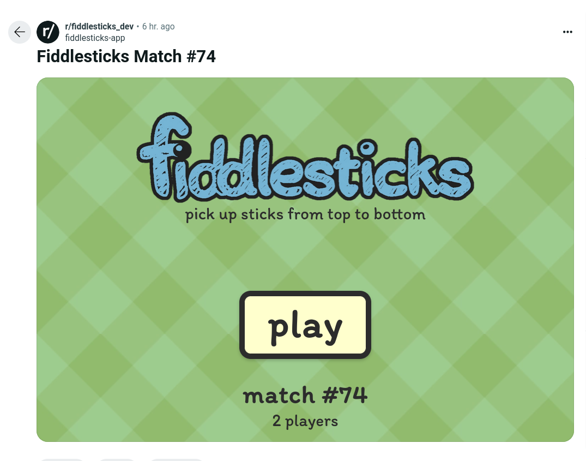
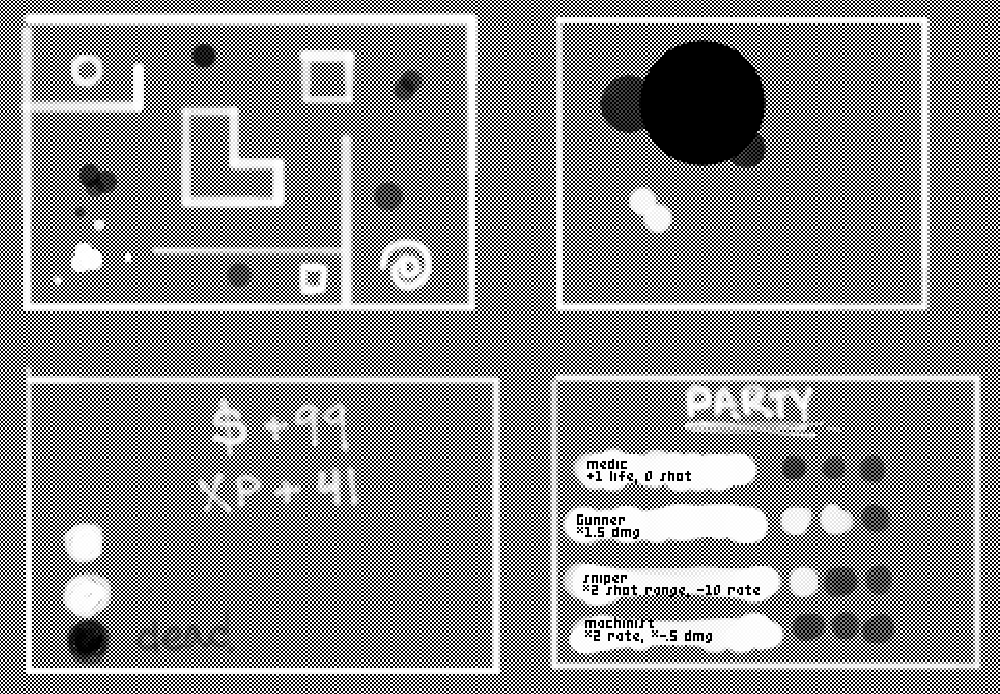

# ⬤◯ [corridor](https://reddit.com/r/corridorgame)

[](resources/demo.mp4)

corridor is a top-down shooter.

## learnings

the team's goal through year end is to build a hit game. corridor's goals were to implement the smallest part of a hit game that was still fun and to not repeat the mistakes of [snoosings](https://github.com/reddit/devvit-snoosings).

corridor was built in about four days from Monday, October 28th, 2024 to Friday, November 1st.

I'm going to start doing:

- target simplicity. I want development to move more quickly and to lower the barrier to entry. most people are baffled by corridor and that is only acceptable if there's a worthy payoff. I want to make a game that is buildable in a week and _feels_ small; simple yet deep. so hard!
- improve clarity. games appear in the feed to all kinds of casual users. it's paramount that the call to action and promise of fun are obvious and highly interactive. I've seen a lot of people in the subreddit but very few new games. I think many don't realize that the text "new corridor" is a button.
- try something brainy. I'm guessing more users are looking for something like solitaire than Teleglitch.
- be tactical about social. networking is hard. I will probably avoid MMOs and pick more focused social features going forward under these time constraints.
- be big and colorful. I like the aesthetic of corridor but I knew it'd be polarizing.
- think critically when planning. you don't get what you don't aim at. I want to be careful not to build something I know I don't want.
- try noEmit and the native unit test runner.

I'm going to keep doing:

- improve speed. keep investing in refactoring the parts of the game I will copy to the next as a template.
- when planning, think tactically of the cost of the whole. code, art, and sound are each expensive. what must I draw? do I need physics? don't handwave art.
- pick an art style that is fast and fun. I was surprised that getting a pleasing pixelated look was so easy as I'm usually pretty picky about it. simple and large blobby shapes were great. the consistent tooth of pixelation noise gave a satisfying texture and worked well the blobs. big oval blobs and fundamental shapes are easy to draw, fun to vary, and easy to read. I feel I have a better sense of what works for fast fun art now and that although I didn't nail a simple game, I felt like I got close to simple art. I'm looking forward to a future opportunity to mix colorful blobs and pixelation.
- make a one page mock. I think this really helped me understand the general direction and not get lost.

### what would make corridor fun?

more depth and polish. I think there's a really fun game to be realized. I have no shortage of ideas but so little time. I ended up only being able to implement a single enemy and a single item on a single level before the deadline. I was thinking this would be an amalgamation of the following games:

- [Mercenary Force](https://www.giantbomb.com/mercenary-force/3030-28408)
- [Cave Noire](http://www.hardcoregaming101.net/cave-noire)
- [Teleglitch](https://www.paradoxinteractive.com/games/teleglitch-die-more-edition)
- [Ninja Taro](https://kayin.moe/ninja-taro)
- [Diablo II](https://en.wikipedia.org/wiki/Diablo_II)
- [Vampire Survivors](https://poncle.itch.io/vampire-survivors)
- [River City Ransom](http://www.seanbaby.com/nes/nes/rcr.htm)

there's so many good ideas packed into the above partial list that numerous novel fun mixes exist. I see a lot of potential for corridor to grow to something meaningful if given time.

these were the rough notes I had at the start of the game when I thought I had two weeks to work on it:

> single-player roguelite with live streaming and replays. only pointer input. only synth sounds. simplified graphics.
> 
> outer loop:
> 1. start a new game spawns a post on the subreddit for live streaming, replay, and for other players to start a new game.
> 2. choose a party of three.
> 3. play three levels.
> 4. fight the boss.
> 5. win: keep points and XP for next playthrough (starting on step 2).
> 6. lose: no gains, points zeroed, XP penalty for next playthrough (starting on step 1).
> 
> non-boss level loop:
> 1. traverse level searching for XP, HP, monsters, and exit. point to move.
> 2. engage monster.
> 3. player and monster auto-shoot one bullet per party member.
> 4. repeat 1-3 until exit is found.
> 
> the boss level is a battle with one big enemy. based on how well you've assembled your party and kept their health, battle is easier or harder. may make this part multiplayer.
> 
> assets:
> - background is a pixel checkerboard.
> - players and enemies are circle groups with variable opacity.
> - bullets are smaller circles.
> - items: XP is a square, health is a circle.
> - levels are dynamic.
> - light means harmless, dark means harmful.
> - exit is a spiral.
> - audio is synth boops.
> - minimalist everything.

the original mock for the above: top-left panel shows non-boss level, top-right is boss, bottom-left is end level screen, bottom right is party select.



I was originally going to make a Flappy Bird clone but my partner told me I could do better. I'm glad I tried.

### synchronizing multiplayer is hard

just _streaming_ the state is going to be a lot harder than I thought. the original game was going to just be the player and maybe a few monsters and items. the new game naively plunks 32k ents in. these are some of the ideas I considered and what I had about 12 hours left:

- only send the current viewport. this would give you kind of a TV-like stream but since realtime is slow and size restricted, we can't send frame by frame. we have to extrapolate. this would likely cause missed bullets to hit and vice versa as the player lerped around. I don't think it would be compelling with the current realtime responiveness. additionally, if the viewer can play and not just view, you have to figure out which enemies target which player and who is the authority on the current state of where enemies are.
- send an initial state 30 seconds ago plus a buffer of all controller inputs received. this sounds ok-ish but I think there's a lot of opportunity to get out of sync. I have to run the simulation at the viewer's framerate and the timing is not going to match. I'll also have to blow away the world every time I get a new message to reset that sync. if I was writing streamable MSPaint, I could report each tool picked and the exact stream of cursor movements. the timing wouldn't matter much because nothing on the canvas is moving. timing matters in corridor.
- send the entire world every message and reset the simulation on every receive. I think this would require a lot of data, a lot of lerping, and a lot of processing for each client. I think it'd look really glitchy.
- send an initial state 30 seconds ago plus a buffer of all state changes using a command pattern with absolute coordinates. I'm not quite sure what the lerping story is and this would require a rearchitecture to operate on commands.

so these sorts of games seem hard to do in realtime:
- any game with client contention. many reflex games might fall into this category. if you reimplemented Diablo II, you'd probably want to clone loot to both players if there was contention for picking it up since loss is frustrating and we don't have a server authority unless you circuit break to redis.
- any game where you have to reconstruct state and timing matters.

games that might work:
- any game where each client is the authority on their avatar and the world is static or the timing doesn't matter.
- player vs enemy games where the monsters don't move a lot and there's not many of them as at any one time. for example, in Diablo II a barbarian has to walk up to a monster and slash them usually multiple times. if multiple players are fighting side-by-side, the only contention is for loot.

if I want to more seriously pursue this, I need to build the game around that concept. I was just trying to build a single-player game and it was hard to pivot. I added all these to-dos to implement a seedable random number generator but that's easy compared to the architecture.

I think there are probably a great big bag of tricks you can use to work around these issues but I don't have the time to realize them and some would probably require a major redesign.

realtime was kind of snoosings thing. the game was built around being able to multiplay. it was disappointing to realize that I had built a game that couldn't duplicate the entire approach.

### WebGL vs Canvas

the Canvas API has not been a blocker for these smaller games. 10 000 mobs evenly distributed and a full screen of tiles (without a pattern) had no lag on my 2018 Android phone. it was a little laggy at 100 thousand but playable as long as you didn't group many thousands on the viewport. I guess my ent management got really sloppy by the end though and even 32 thousand is sometimes laggy on my phone. I think most of my frame is eaten up by naive world processing instead of partitioning.

one disappointment was that createPattern() doesn't support spritesheets so I stuck with one file per sprite.

### esbuild and playtest

I made all online data optional and deliverable at any time. this allowed me to develop the game almost entirely offline using an esbuild server with subsecond reloads. further into the project, I ran `devvit playtest` in parallel and the combo worked excellently.

### node unit test runner with type stripping

it occurred to me for the first time that I might use type-stripping for unit tests and skip the vitest dependency.

```jsonc
// package.json
"test:unit": "NODE_OPTIONS='--experimental-strip-types --no-warnings=ExperimentalWarning' node src/**/*.test.*",
```

```ts
// 2d.test.ts
import assert from 'node:assert/strict'
import {describe, test} from 'node:test'
import {angleBetween, dotProduct, magnitude} from './2d.ts'

describe('dotProduct()', () => {
  test('v · v', () => {
    assert.equal(
      dotProduct(
        {x: -0.6836781075757513, y: 0.7297836975581459},
        {x: -0.6836781075757514, y: 0.7297836975581458}
      ),
      1
    )
  })
})
```

sadly, I found this requires .ts extension imports all the way up. although esbuild has no trouble with .ts, the TypeScript compiler doesn't support it for any outputs:

```
src/shared/tsconfig.json:4:3 - error TS5096: Option 'allowImportingTsExtensions' can only be used when either 'noEmit' or 'emitDeclarationOnly' is set.
```

esbuild does all the compilation and bundling, not tsc, but I think I had some trouble with my composite project settings and noEmit. I'm going to give it another go.

### sharing

I was building my game in public once I got to the Reddit integration. I had just implemented the logic to create a new post for each new game and was debugging the game over / new game prompt screen. instead of waiting for user input, I was accdentially just blindly spawning a new game post on lose. I surmise that, in combination with cranking up the difficulty, this caused casual feed viewing to spawn many new posts and spread like a virus across Reddit. I believe this bug only existed for 15 minutes(?) but must have created over 500 posts.

once it was working, I think having each post as a unique gaming session was a good paradigm.

### input

I think using a pointer for all input was the way to go. I did add keyboard and gamepad support but they're just alternatives.

### not maintaining a game library

not maintaining a little game library like [void](https://github.com/oidoid/void) has been a time saver but on the flip side, it's been really hard sometimes to say goodbye to code that I think I'll want for a future game. copying and pasting works great as long as you never have to look back.

## the road ahead

- open-source along with snoosings.
- hope to continue development one day?
- build something new, small, and popular.
